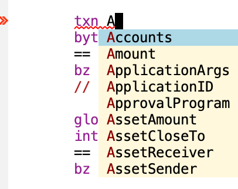
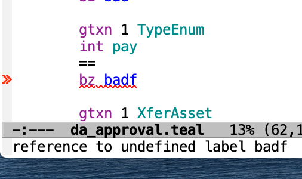

# teal-mode

Emacs support for editing Algorand's TEAL Smart Contract language. It
looks a lot like assembly language for a stack machine.

Add teal-mode.el to your load-path, and then use use-package.  For
example, I have the source in ~/github/jannotti/teal-mode, so:

```
(add-to-list 'load-path (expand-file-name "~/github/jannotti/teal-mode"))
(use-package teal-mode
  :mode ("\\.teal\\'"))
```

Of course you can `(load "teal-mode")` and edit `auto-mode-alist` by
hand if you're some sort of barbarian.

```
(load "teal-mode")
(setq auto-mode-alist (append
                       '(("\\.teal\\'" . teal-mode))
		               auto-mode-alist))
```

## Syntax

## Completion

teal-mode uses the completeion-at-point facilities, so it should
integrate with whatever you might be using that builds on that.  For
example, company gives:



## Flycheck

